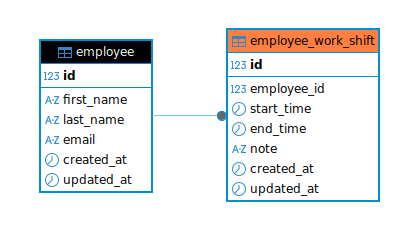

# Employee Time Tracking API

## Warning
I have created and tested everything on ubuntu 20.04. There is no warrenty that it works also on other systems unless the exact conditions according to the config files are implemented

## About Django

This document doesn't include Django architecture but I am completeing a set of documents that can be found here:
[Django architecture learning project](https://github.com/donkarlo/nd_python_learning_project/tree/main/src/web/django)

## Install composer if you don't have it already installed 

```bash
sudo apt update
sudo apt install -y docker.io docker-compose-v2
```

## Includes

- Employee CRUD
- Work-shift CRUD for each employee
- Validation that `end_time` is after `start_time`
- Prevention of overlapping shifts for the same employee
- employee summary
- employee statistics
- PostgreSQL
- Docker Compose
- mypy
- API tests

There is no frontend and no authentication because they are non-goals in the assignment.

## Architecture 
I used module as the root to put whatever only related to employee in it. In employee there is another module as a sub module of employee for time tracking issues of the employees. When necessary these modules can be extended vertically and horiyentally

The project has one Django module, `employee`, and `time_tracking` is a submodule of it:

```text
module/
└── employee/
    ├── apps.py                                  # Django app configuration
    ├── urls.py                                  # Employee API routes
    ├── management/
    │   └── commands/
    │       └── seed_demo_data.py                # Creates demo employees and work shifts
    ├── migrations/
    │   └── 0001_initial.py                      # Initial database schema
    ├── models/
    │   └── employee.py                          # Employee database model
    ├── serializers/
    │   └── employee_serializer.py               # Validates employee request and response data
    ├── repositories/
    │   └── employee_repository.py               # Executes employee CRUD database queries
    ├── views/                                   # To handle the requests and provide reponses similar to controller in MVC
    │   ├── employee_collection_view.py          # Lists and creates employees
    │   └── employee_detail_view.py              # Retrieves, updates, and deletes one employee
    └── module/
        └── time_tracking/
            ├── urls.py                          # Work-shift and statistics API routes
            ├── models/
            │   └── work_shift.py                # Work-shift database model
            ├── serializers/
            │   └── work_shift_serializer.py     # Validates work-shift request and response data
            ├── repositories/
            │   └── work_shift_repository.py     # Executes work-shift CRUD database queries
            ├── services/
            │   ├── overlap_validation_service.py # Prevents overlapping work shifts
            │   ├── employee_summary_service.py   # Calculates one employee's work summary
            │   └── global_statistics_service.py  # Calculates statistics for all employees
            └── views/                            # To handle request and validate responses
                ├── work_shift_collection_view.py # Lists and creates work shifts
                ├── work_shift_detail_view.py     # Retrieves, updates, and deletes one work shift
                ├── employee_summary_view.py      # Returns one employee's work summary
                └── global_statistics_view.py     # Returns statistics for all employees
```
## Databse
A readable copy of all SQL is available in `data/sql/crud.sql`. The database schema is in `data/sql/schema.sql` and in the initial Django migration.

Since there is only one migrations you dont need them. But in a hypothetical case that there are many migrations you can use
``` bash
python manage.py migrate employee 000x
```
to move between migration

### Database schema


# installing the project
Warning: since I use ubuntu 20.04, I use an old version of composer  so might need to use `docker compose` instead of
`docker-compose` every where

## First run to build the image compose.yaml

```bash
docker-compose up --build -d
```

Check the containers:

```bash
docker-compose ps
```

## API url and postgresql port
The API is available at `http://localhost:8000`.

PostgreSQL is available to DBeaver on `localhost:5433`.


## Reset the local database

This deletes all local application data (including the database and the data in it):

Do not worry because by running    `docker-compose up --build -d` again, 

```bash
docker-compose down -v
```
## If you think you already have the image and  you want to use that image please use

```bash
docker-compose up -d
```

## Reinstalling
This deletes all local application data (but keeps database data ):
```bash
docker-compose down
```

Then start again:

```bash
docker-compose up --build -d
```

## Starting and stopping the services and restarting when you are sure that the image exists

Stopping

```bash
docker-compose stop
```

Starting

```bash
docker-compose start
```

or restarting all services

```bash
docker-compose restart
```

restarting only the webserver

```bash
docker-compose restart web
```

restarting postgresql

```bash
docker-compose restart db
```


# API URLs

| Method | URL | Purpose |
|---|---|---|
| GET | `/api/employees/` | List employees |
| POST | `/api/employees/` | Create an employee |
| GET | `/api/employees/{employee_id}/` | Get one employee |
| PUT | `/api/employees/{employee_id}/` | Replace an employee |
| PATCH | `/api/employees/{employee_id}/` | Partially update an employee |
| DELETE | `/api/employees/{employee_id}/` | Delete an employee |
| GET | `/api/employees/{employee_id}/time-tracking/` | List the employee's shifts |
| POST | `/api/employees/{employee_id}/time-tracking/` | Create a shift |
| GET | `/api/employees/{employee_id}/time-tracking/{shift_id}/` | Get one shift |
| PUT | `/api/employees/{employee_id}/time-tracking/{shift_id}/` | Replace a shift |
| PATCH | `/api/employees/{employee_id}/time-tracking/{shift_id}/` | Partially update a shift |
| DELETE | `/api/employees/{employee_id}/time-tracking/{shift_id}/` | Delete a shift |
| GET | `/api/employees/{employee_id}/time-tracking/summary/` | Employee summary |
| GET | `/api/employees/time-tracking/statistics/` | Global statistics |

## Small request example

Create a sample employee

```bash
curl -X POST http://localhost:8000/api/employees/ -H "Content-Type: application/json" -d '{"first_name":"Maryam","last_name":"Rad","email":"anna@example.com"}'
```

Create a shift for employees 1:

```bash
# Anna Muster - employee_id = 1

curl -i -X POST http://127.0.0.1:8000/api/employees/4/time-tracking/ \
  -H "Content-Type: application/json" \
  -d '{"start_time":"2026-07-23T08:00:00+02:00","end_time":"2026-07-23T16:00:00+02:00","note":"Morning shift"}'
```

## To have a nicer format in terminal run
```bash
sudo apt-get install jq
```

## Get all shifts of employee 2

```bash
curl -s http://127.0.0.1:8000/api/employees/2/time-tracking/ | jq
```

## Get the summary for employee 2:
```bash
curl -s http://localhost:8000/api/employees/2/time-tracking/summary/ | jq
```

## Get global statistics
```bash
curl -s GET http://localhost:8000/api/employees/time-tracking/statistics/ | jq
```

## Overlap rule

Shifts use half-open intervals: `[start_time, end_time)`. Therefore, a shift ending at `16:00` and another starting at `16:00` do not overlap.

The overlap SQL condition is:

```sql
start_time < new_end_time AND end_time > new_start_time
```

# Testing


## unit testing
```bash
docker-compose exec web python manage.py test
```
or if you prefere to run it through pytest
```bash
docker-compose run --rm web pytest
```
## mypy
Checking consistency of variable types
```bash
docker-compose exec web mypy .
```

## Django checks
To test the whole Django ecosystem on your machine

```bash 
docker-compose exec web python manage.py check
```

The command checks:

- The validity of `settings.py`
- Model definitions
- Relationships between models
- URL configuration
- Applications registered in `INSTALLED_APPS`
- Certain migration-related errors
- Security and compatibility settings
- Whether project modules can be imported correctly

## 